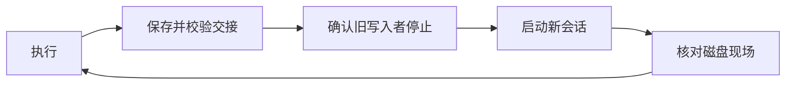

# Longdev 会话运行时适配

longdev 的任务连续性以磁盘任务记录为准。客户端会话只是执行载体，可以结束、恢复或替换；切换会话前必须先写入任务交接包，不能把未落盘的对话历史当作唯一状态。

## 会话交接契约

每次准备切换会话时，在任务目录写入 `context/current.md`，至少包含：

- 任务路径、项目根目录和当前客户端
- 当前阶段、状态、R/V 集合及其剩余项
- 实际修改文件和最新产物 manifest
- 最近一次有效 review/gate 及失效证据
- 未完成动作、阻碍、授权边界和唯一下一步
- 当前会话标识、切换原因和生成时间

新会话启动后，先读取 `PLAN.md`、`context/current.md`、当前阶段入口和最新 review/gate，再核对实际文件。发现交接包与现场不一致时进入诊断或待检查，不能直接重复实现。

## 客户端适配

适配器只负责启动、恢复、停止和传递初始交接提示；不负责改变 R/V 状态，也不把客户端的“成功退出”当作任务完成。

| 客户端 | 新会话 | 恢复 | 交接方式 | 约束 |
|---|---|---|---|---|
| Claude Code CLI | `claude` | `claude --continue` 或 `claude --resume <id>` | 启动提示指向 `context/current.md` | `--continue` 依赖当前项目目录；精确恢复优先使用 session id |
| Codex CLI | `codex` 或 `codex exec` | `codex resume --last` / 指定会话；需要分支时 `codex fork` | 启动提示指向交接包；可用 app-server 管理 thread | `resume` 延续旧历史；要降低历史负担应新建 thread 并读交接包 |
| dsh | `dsh --profile headless <task>` 或用户指定 profile | `--resume <session>` 仅在 profile/app 暴露该参数时使用 | 将交接包路径写入 task 文本 | 先执行 `dsh --profile <name> --help`；未知 profile 不猜命令，不把一次 headless 运行当成可恢复会话 |

适配器启动前必须检测命令是否存在、工作目录是否正确、profile/会话参数是否受支持。检测失败时记录为外部依赖受阻，并输出可手动执行的命令；不得静默降级到另一个客户端。

## 同一工作目录的客户端轮换

同一工作目录可以有多个独立任务；同一逻辑任务只保留一个任务目录和任务 ID。Claude Code、Codex CLI、dsh 轮换时，复用该任务的共同状态：

```text
.claude/longdev/<任务>/
  PLAN.md                 唯一任务索引、R/V 和阶段状态
  context/current.md      当前执行租约和交接包
  stages/N.md             阶段入口、执行记录和下一步交接
  reviews/                独立审查
  gates/                  主会话 gate
  evidence/               原始日志和 manifest
```

每次轮换按以下顺序执行：

1. 当前客户端完成一个有限动作，或在安全边界停止；写入 `stages/N.md` 和 `context/current.md`。
2. 在交接包中记录 `client`、`session_id`、`lease_owner`、`lease_expires`、`working_tree_fingerprint` 和 `next_action`。
3. 当前客户端退出或明确释放租约；没有释放证据时，新客户端只能检查状态，不能写入。
4. 新客户端读取同一任务目录，核对工作区、租约和实际产物，再取得当前阶段租约。
5. 新客户端只执行 `next_action`，完成后回到第 1 步。

客户端的会话历史不跨客户端复用。Claude 的 transcript、Codex 的 thread、dsh 的 profile session 都只是各自的辅助上下文；跨客户端的信息通过 `PLAN.md`、阶段交接、决策和证据传递。

推荐把 `context/current.md` 中的租约字段写成机器可读格式，例如：

```yaml
task_id: migrate-api
stage: 2
client: codex-cli
session_id: <client-session-id>
lease_owner: <process-or-user-id>
lease_expires: 2026-09-22T16:30:00+08:00
working_tree_fingerprint: <manifest-path>
next_action: "读取 stages/2.md，修复 review 中的 R03/V04 问题"
```

`lease_expires` 只用于发现失联会话，不能自动证明旧客户端已经停止。过期后必须检查进程、文件变化和命令结果；确认没有并发写入者，或由用户明确接管后，才能重新取得租约。

## 模型配置与路由

客户端和模型分开记录。一个任务可以在不同客户端和模型之间轮换，但每次接管都必须在交接包中写明：

```yaml
client: codex-cli
runtime_profile: deepseek-v4-flash
model: deepseek-v4-flash
capabilities:
  tool_use: verified
  code_edit: verified
  vision: unsupported
  max_input_policy: configured
```

建议维护项目内的模型能力档案，例如 `notes/model-profiles.md`。能力档案只记录已验证事实；未知能力标为 `unknown`，不能因为模型名称推断支持工具、视觉、上下文长度或可靠性。

所有阶段默认继承用户选定模型或运行时 default；有已确认支持的 high 或等价推理档位时优先使用，用户指定更强档位则保留。不得因为实现、检索或机械转换角色而自动换成低价/弱模型。Claude/GPT/DeepSeek/GLM 按实际部署的已验证能力使用，不按品牌分配高低风险职责。模型 ID、推理字段和值以当前客户端帮助或部署配置为准；不支持 high 时记录限制并保留 default，不伪造参数已生效。能力档案不保存凭据。

模型能力不足、输出异常或验证失败时，先停止依赖该结果的推进，从最近有效 checkpoint 核对现场，保留当前代码和诊断，不自动回滚。升级档位后重新核对受影响 R/V，不把换模型当作错误已修复。

## 多模态图片隔离

当私有化模型的图片限制未知、可能累计历史图片，或已知存在总图片数上限时，采用最保守策略：

1. 主会话、跨客户端交接和主会话 gate 保持纯文字，不发送图片，也不调用会把图片返回到主会话的预览入口。
2. 每张图片使用独立视觉子会话，完整请求最多一张图片，不继承含图历史，完成后不复用。不假定子 agent 天然隔离；先核实隔离和多模态能力，无法核实时使用独立视觉服务或将相关 V 保持未验证。
3. 子会话只回传 OCR/视觉观察、图片路径、哈希和不确定项；原图保留在任务证据目录。
4. reviewer 和 gate 的主上下文只接收文字结果及路径；需要独立视觉复核时另开单图会话读原图，不能只认可实现者摘要。OCR 不能替代版式、颜色、遮挡等视觉验收；缺少可靠视觉能力时相关 V 保持未验证。
5. 图片历史已经进入某个会话后，不假设摘要或继续发送文字就会清除图片；迁移到新的纯文字主会话或新的单图子会话。

图片隔离是会话边界，不是模型降级策略。必须保持原验收标准；图片处理失败时记录受阻并继续没有该图片依赖的独立工作。

切换模型时，不能直接把前一模型的自然语言摘要当作事实。新模型必须重新读取任务索引、当前阶段、决策和证据；若模型能力档案发生变化，受影响的 V 需要重新核验。模型切换不会改变 R/V 标准、授权边界或 review/gate 职责。

模型路由还应记录原因和回退条件，例如“DeepSeek 配额耗尽，转 Codex/GPT 完成 reviewer；实现产物保持不变”。配额、速率限制和上下文预算属于运行时状态，不得改写为需求完成或阶段通过。

## 会话切换状态机



旧会话仍可能执行时，不得启动同一任务的新写入者。运行器应使用任务锁或等价机制；没有锁能力时保持 `handoff-ready`，等待人工确认。

## 运行器与手动模式

没有外部运行器时，主会话仍可完成 checkpoint，用户手动在新终端启动客户端；这属于有效的跨会话恢复。运行器只是把“写交接、启动新会话、传入交接提示、记录会话 ID”自动化，不能替代主会话的 review 和 gate。

安装器不实现自动 restart、进程租约或图片请求拦截；上述状态机是交接契约，不能宣称已自动执行。每个有意义的动作后更新现有 PLAN/阶段记录，换会话前的 context/current.md 只保留索引、授权、未完成项和下一动作。上下文水位仅采信客户端遥测或用户提供值，不可读取时记 unknown，不猜百分比。水位偏高先保存交接，再使用已验证的压缩/新会话入口；摘要落盘不等于历史已移除。
